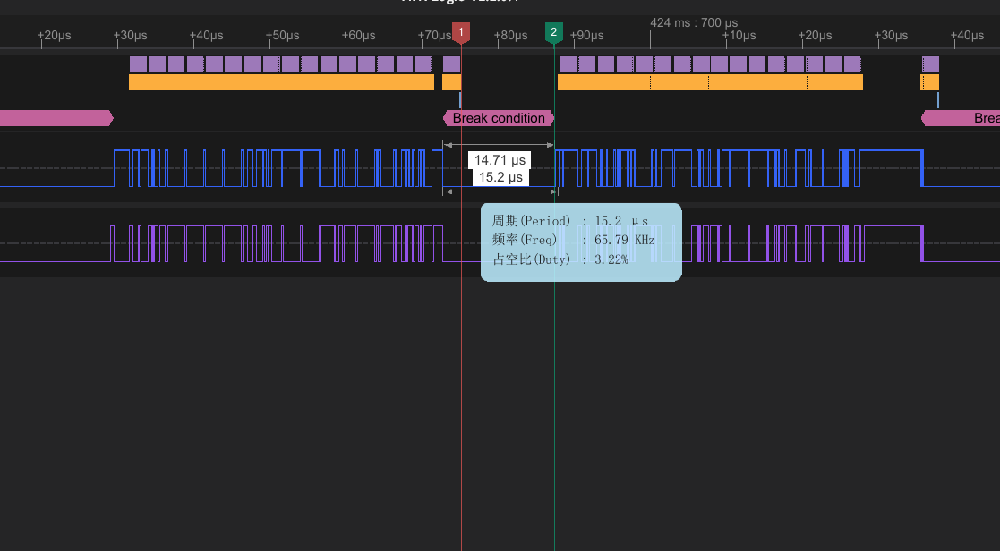
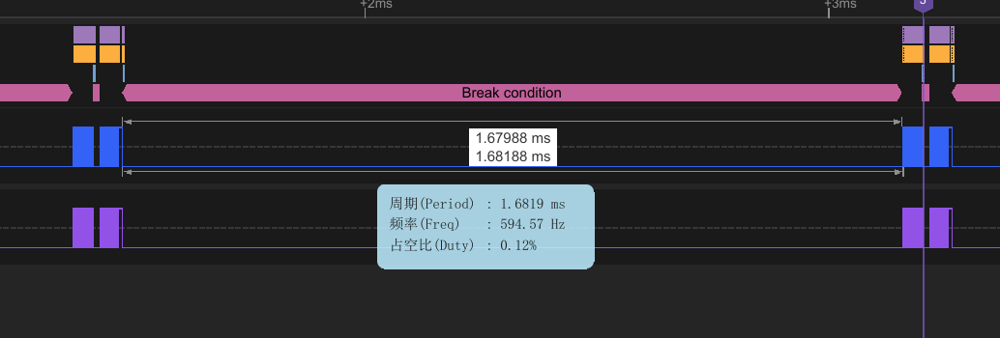

# Axis_Robot(智能桌面机械臂)
## 更新日志：

### 2025-1-25： 

1.新建文件夹，2.cubemx建立，3.freertos建立；

### 2025-1-26： 

1.imu、rgb在freertos中实现；

### 2025-1-27

1.基础框架搭建，2.fdcan电机通讯，3.rs485通讯

### 2025-1-28

## 调试日记

### 2025-1-28

rs485通讯：我给宇树电机发送一个17字节的数据，他收到之后大概15us给我反馈一个16字节的数据，但是cubemx中不使用硬件rs485，有很大概率，stm32收到前几秒的数据之后就收不到了。

## 更新日志：

### 2025-1-25： 

1.新建文件夹，2.cubemx建立，3.freertos建立；

### 2025-1-26： 

1.imu、rgb在freertos中实现；

### 2025-1-27

1.基础框架搭建，2.fdcan电机通讯，3.rs485通讯

### 2025-1-28

## 调试日记

### 2025-1-28

1、rs485通讯：我给宇树电机发送一个17字节的数据，他收到之后大概15us给我反馈一个16字节的数据，但是cubemx中不使用硬件rs485，有很大概率，stm32收到前几秒的数据之后就收不到了。更换到硬件rs485目前正常，后续继续测试验证。

后续测试来了：只能支撑不到8分钟()，又收不到了

下图是不正常的，一直没有收到数据，函数等待1ms后，超时退出，进入下一次循环：

HAL_UARTEx_ReceiveToIdle函数一直堵塞着想收到他，但是并没有收到，逻辑分析仪是正常的，很奇怪。

下图是正常的：

请注意，正常和不正常使用逻辑分析仪抓数据波形，发完数据到电机反馈数据的延迟都是固定的15us左右。

2、突然发现宇树给的rs485的收发例程是堵塞函数，

HAL_UART_Transmit(&huart2, (uint8_t *)pData, sizeof(pData->motor_send_data), 1); 

HAL_UARTEx_ReceiveToIdle(&huart2, (uint8_t *)rData, sizeof(rData->motor_recv_data), &rxlen, 1);

我使用的是freertos，得想个办法换成不堵塞，以免其他线程收到干扰。

3、

